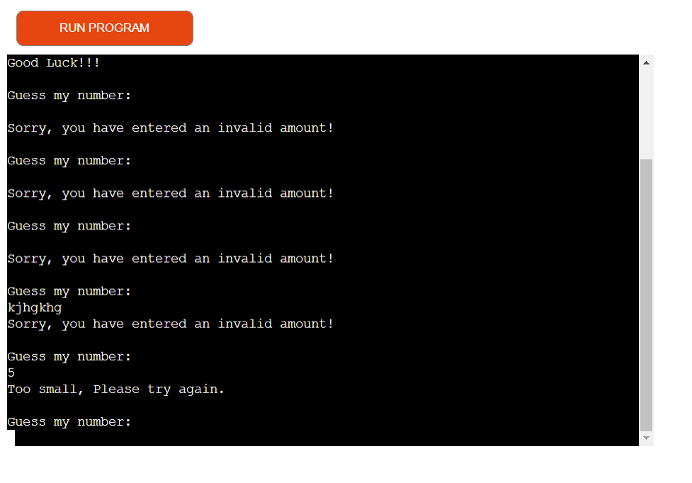

## Guess My Number
---

Guess My Number is a python terminal game, which runs in the Code Institute moch terminal on Heroku

Users can guess the number which is assigned by computer, by answering wrong numbers, players score will come down until they loss the game.

Guess My Number has range of 1 to 20 to make interisting the evironment of game play.

<a href="https://guesss-my-number.herokuapp.com/">Here is the live version of my project</a>


## How to play
---
It is a guessing game that the computer thinks of a number between 1 and 20, and users guess the number between this range. If the number is less or greater than the wanted number, they will receive feedback about their answer to enable them to guess another number. If the answer that the user provide is not correct then their score will decrease and descrease until they fail.

## Features
---
## Existing Features
* Random guessing number generation
* The user don't know what are the correct answer
* The user needs to guess until he/she finds the correct answer
* By answering wrong value the user will be ask to enter the correct number
* By entering invalid number the user will be ask to enter correct number
* This game is completely validated and no invalid entry will break its operation

    


## Future Features
* Allow users to select maximum range of guessing
* Add more validation for being more user friendly


## Data Model
---
I decided to create an input for the users to enter their guessing value and the computer will check their answer and show the result of the game.

In this game *user_answer* and *computer_random_number* is very important and the operation will be handled base on them.

In this game contains multi functions like: ```get_user_answer```, ```validate_user_answer```, ```generate_random_number```, ```check_game_result``` and ```main``` functions.

## Testing
---
I have manually tested this project by doing the following steps:
* Passed the code through the PEP8 linter and did't found any problem there
* I have entered invalid inputs like string, empty value, but every thing was working normally and each error was handled very well.
* I tested it in my local terminal and Heroku terminal it was working as expected

## Validator Testing
* PEP8
    * No errors were found in PEP8online.com

## Deployment
---
This project was deployed in github and then Heroku

* Steps for deployment:
    * Fork or clone this repository
    * Create a new Heroku app
    * Set the buildbacks to ```Python``` and ```NodeJS``` in that order
    * Link the Heroku app to the repository
    * Click on **Deploy**

## Credits
---
* Code Institute for deployment terminal
* Google and other free websites for game idea


